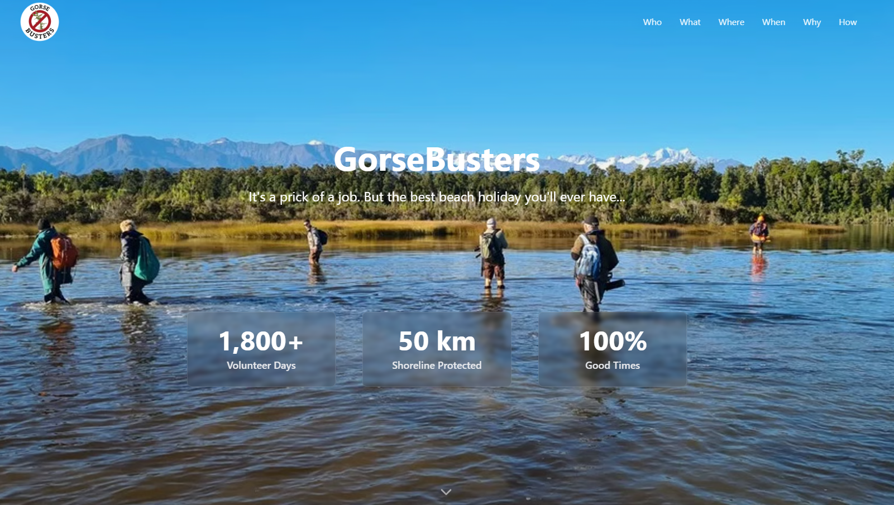

# .gitignore

```
# Node modules
node_modules/

# Build directory
dist/

# Environment variables
.env
.env.local
.env.development.local
.env.test.local
.env.production.local

# Log files
npm-debug.log*
yarn-debug.log*
yarn-error.log*

# macOS files
.DS_Store
.AppleDouble
.LSOverride

# Windows files
Thumbs.db
ehthumbs.db
Desktop.ini

# Editor directories
.idea/
.vscode/
*.swp
*.swo
```

# .vscode\settings.json

```json
{
    "cSpell.words": [
        "democratise",
        "Durq",
        "HUSL",
        "organisation",
        "roguedronesnz",
        "specialise",
        "videography",
        "Zudh"
    ],
    "postman.settings.dotenv-detection-notification-visibility": false
}
```

# build-optimized.js

```js
/**
 * build-optimized.js
 * Enhanced build script for Rogue Drones website with Mapbox integration
 * - Replaces environment variables in files
 * - Minifies JavaScript and CSS
 * - Optimizes images for web delivery
 * - Sets up proper caching headers
 * - Copies all assets to dist folder
 */
require('dotenv').config();
const fs = require('fs-extra');
const path = require('path');
const { minify } = require('terser');
const { minify: minifyHtml } = require('html-minifier-terser');

// Environment variables - Mapbox instead of Google Maps
process.env.MAPBOX_ACCESS_TOKEN = process.env.MAPBOX_ACCESS_TOKEN || 'YOUR_MAPBOX_ACCESS_TOKEN_HERE';

process.env.EMAILJS_USER_ID = process.env.EMAILJS_USER_ID || 'YOUR_EMAILJS_USER_ID_HERE';
process.env.EMAILJS_SERVICE_ID = process.env.EMAILJS_SERVICE_ID || 'YOUR_EMAILJS_SERVICE_ID_HERE';
process.env.EMAILJS_TEMPLATE_ID = process.env.EMAILJS_TEMPLATE_ID || 'YOUR_EMAILJS_TEMPLATE_ID_HERE';

// Paths
const distPath = './dist';

// Ensure dist directory exists and is empty
fs.emptyDirSync(distPath);

// Specify which files/folders to copy
console.log('Copying files to dist directory...');
const filesToCopy = [
  { src: './static-index.html', dest: path.join(distPath, 'index.html') },
  { src: './css', dest: path.join(distPath, 'css') },
  { src: './js', dest: path.join(distPath, 'js') },
  { src: './images', dest: path.join(distPath, 'images') }
];

// Copy each file/folder
filesToCopy.forEach(({ src, dest }) => {
  if (fs.existsSync(src)) {
    if (fs.lstatSync(src).isDirectory()) {
      fs.copySync(src, dest);
      console.log(`Copied directory: ${src} -> ${dest}`);
    } else {
      fs.copySync(src, dest);
      console.log(`Copied file: ${src} -> ${dest}`);
    }
  } else {
    console.warn(`Warning: Source does not exist: ${src}`);
  }
});

// Process HTML files - Replace Mapbox tokens and optimize loading
const processHtmlFiles = async () => {
  console.log('Processing HTML files...');
  
  const htmlFiles = getFilesWithExtension(distPath, '.html');
  
  for (const file of htmlFiles) {
    console.log(`Processing HTML: ${file}`);
    let content = fs.readFileSync(file, 'utf8');
    
    // Replace Mapbox access token placeholder with actual token from .env
    content = content.replace(
      /YOUR_MAPBOX_ACCESS_TOKEN/g,
      process.env.MAPBOX_ACCESS_TOKEN
    );
    
    // Add preload hints for critical images
    content = content.replace(
      '<head>',
      `<head>
    <!-- Preload critical images -->
    <link rel="preload" as="image" href="images/home_image.JPG">
    <link rel="preload" as="image" href="images/rogue_drones_white.png">
    <!-- DNS prefetch for external resources -->
    <link rel="dns-prefetch" href="//cdn.jsdelivr.net">
    <link rel="dns-prefetch" href="//cdnjs.cloudflare.com">
    <link rel="dns-prefetch" href="//api.mapbox.com">
    <link rel="dns-prefetch" href="//fonts.googleapis.com">`
    );

    // Add image optimization attributes
    content = content.replace(
      /]*src="images\/[^"]*"[^>]*)>/g,
      ''
    );

    // Optimize hero image loading specifically
    content = content.replace(
      /style="background-image: url\('images\/home_image\.JPG'\);"/,
      `style="background-image: url('images/home_image.JPG'); background-size: cover; background-position: center; will-change: transform;"`
    );
    
    // Minify HTML
    const minified = await minifyHtml(content, {
      collapseWhitespace: true,
      removeComments: true,
      minifyCSS: true,
      minifyJS: true,
      removeRedundantAttributes: true,
      removeScriptTypeAttributes: true,
      removeStyleLinkTypeAttributes: true,
      useShortDoctype: true
    });
    
    fs.writeFileSync(file, minified);
  }
};

// Process JS files - Replace Mapbox tokens and minify
const processJsFiles = async () => {
  console.log('Processing JavaScript files...');
  
  const jsFiles = getFilesWithExtension(distPath, '.js');
  
  for (const file of jsFiles) {
    console.log(`Processing JS: ${file}`);
    let content = fs.readFileSync(file, 'utf8');
    
    // Replace Mapbox access token in JavaScript files
    content = content.replace(
      /YOUR_MAPBOX_ACCESS_TOKEN/g,
      process.env.MAPBOX_ACCESS_TOKEN
    );

    // Replace EmailJS tokens in JavaScript files
    content = content.replace(
      /YOUR_EMAILJS_USER_ID/g,
      process.env.EMAILJS_USER_ID
    );
    content = content.replace(
      /YOUR_SERVICE_ID/g,
      process.env.EMAILJS_SERVICE_ID
    );
    content = content.replace(
      /YOUR_TEMPLATE_ID/g,
      process.env.EMAILJS_TEMPLATE_ID
    );
    
    // Minify and optimize JS
    const result = await minify(content, {
      compress: {
        drop_console: false, // Keep console for debugging, set to true for production
        drop_debugger: true,
        pure_funcs: ['console.log'], // Remove console.log in production
      },
      mangle: {
        toplevel: true,
      },
      output: {
        comments: false
      },
      sourceMap: false // Set to true if you want source maps
    });
    
    fs.writeFileSync(file, result.code);
  }
};

// Process CSS files - Add Mapbox styles and minify
const processCssFiles = async () => {
  console.log('Processing CSS files...');
  
  const cssFiles = getFilesWithExtension(distPath, '.css');
  
  for (const file of cssFiles) {
    console.log(`Processing CSS: ${file}`);
    let content = fs.readFileSync(file, 'utf8');
    
    // Add Mapbox-specific CSS optimizations
    const mapboxStyles = `
/* Mapbox Container Styling */
.mapbox-container {
    position: relative;
    overflow: hidden;
    width: 100%;
    height: 400px;
    transition: transform 0.3s ease;
    border: 2px solid #ff6f61;
    border-radius: 0.25rem;
}

.mapbox-container:hover {
    transform: scale(1.02);
}

/* Mapbox popup styling */
.mapboxgl-popup-content {
    padding: 10px !important;
    border-radius: 8px !important;
    box-shadow: 0 4px 12px rgba(0, 0, 0, 0.3) !important;
}

.mapboxgl-popup-tip {
    border-top-color: white !important;
}

/* Control styling */
.mapboxgl-ctrl-group {
    background-color: rgba(255, 255, 255, 0.9) !important;
    border-radius: 6px !important;
    box-shadow: 0 2px 6px rgba(0, 0, 0, 0.2) !important;
}

.mapboxgl-ctrl button:hover {
    background-color: rgba(255, 111, 97, 0.1) !important;
    color: #ff6f61 !important;
}

.mapboxgl-ctrl-geolocate {
    background-color: #ff6f61 !important;
    color: white !important;
}

.mapboxgl-ctrl-geolocate:hover {
    background-color: #e55a4f !important;
}

@media (max-width: 767px) {
    .mapbox-container {
        height: 300px;
        margin-top: 2rem;
    }
}
`;
    
    // Add critical CSS optimizations and Mapbox styles
    content = `/* Critical CSS optimizations */
html { font-display: swap; }
img { max-width: 100%; height: auto; }
.hero-logo { content-visibility: auto; }

${mapboxStyles}

${content}`;
    
    // Minify CSS
    const minified = await minifyHtml(`<style>${content}</style>`, {
      minifyCSS: true
    });
    
    // Extract the CSS from the minified HTML
    const extractedCSS = minified.match(/<style>(.*?)<\/style>/s)[1];
    
    fs.writeFileSync(file, extractedCSS);
  }
};

// Helper function to get all files with a specific extension
function getFilesWithExtension(dir, extension, files = []) {
  const entries = fs.readdirSync(dir, { withFileTypes: true });
  
  for (const entry of entries) {
    const fullPath = path.join(dir, entry.name);
    
    if (entry.isDirectory()) {
      getFilesWithExtension(fullPath, extension, files);
    } else if (entry.name.endsWith(extension)) {
      files.push(fullPath);
    }
  }
  
  return files;
}

// Create enhanced _headers file for Cloudflare with Mapbox CSP
const createHeadersFile = () => {
  console.log('Creating enhanced _headers file for Cloudflare...');
  
  const headersContent = `# Enhanced headers for Rogue Drones website with Mapbox
/*
  Strict-Transport-Security: max-age=31536000; includeSubDomains; preload
  Content-Security-Policy: default-src 'self'; script-src 'self' https://cdn.jsdelivr.net https://api.mapbox.com https://cdnjs.cloudflare.com 'unsafe-inline'; style-src 'self' https://cdn.jsdelivr.net https://cdnjs.cloudflare.com https://fonts.googleapis.com https://api.mapbox.com 'unsafe-inline'; img-src 'self' data: https://*.mapbox.com https://*.mapbox.cn blob:; connect-src 'self' https://*.mapbox.com https://*.mapbox.cn https://*.philhardman.workers.dev https://rogue-drones-website.philhardman.workers.dev; font-src 'self' https://cdnjs.cloudflare.com https://fonts.gstatic.com data:; frame-src 'self'; object-src 'none'; worker-src 'self' blob:
  X-Content-Type-Options: nosniff
  X-XSS-Protection: 1; mode=block
  X-Frame-Options: SAMEORIGIN
  Referrer-Policy: no-referrer-when-downgrade
  Permissions-Policy: geolocation=self, microphone=(), camera=()

# Cache static assets for better performance
/css/*
  Cache-Control: public, max-age=31536000, immutable

/js/*
  Cache-Control: public, max-age=31536000, immutable

/images/*
  Cache-Control: public, max-age=2592000
  Accept-Ranges: bytes

# Optimize image formats
/images/*.jpg
  Content-Type: image/jpeg

/images/*.png
  Content-Type: image/png

/images/*.gif
  Content-Type: image/gif

# Main HTML file - shorter cache
/
  Cache-Control: public, max-age=3600

/index.html
  Cache-Control: public, max-age=3600
`;

  fs.writeFileSync(path.join(distPath, '_headers'), headersContent);
};

// Create robots.txt file
const createRobotsTxt = () => {
  console.log('Creating robots.txt...');
  
  const robotsContent = `User-agent: *
Allow: /
Disallow: /cgi-bin/
Disallow: /tmp/

# Sitemap
Sitemap: https://roguedrones.co.nz/sitemap.xml
`;

  fs.writeFileSync(path.join(distPath, 'robots.txt'), robotsContent);
};

// Create sitemap for better SEO
const createSitemap = () => {
  console.log('Creating sitemap.xml...');
  
  const sitemapContent = `<?xml version="1.0" encoding="UTF-8"?>
<urlset xmlns="http://www.sitemaps.org/schemas/sitemap/0.9">
  <url>
    <loc>https://roguedrones.co.nz/</loc>
    <lastmod>${new Date().toISOString().split('T')[0]}</lastmod>
    <changefreq>weekly</changefreq>
    <priority>1.0</priority>
  </url>
</urlset>`;

  fs.writeFileSync(path.join(distPath, 'sitemap.xml'), sitemapContent);
};

// Update wrangler.toml with enhanced configuration
const updateWranglerConfig = () => {
  console.log('Updating wrangler.toml for optimized deployment...');
  
  const wranglerContent = `# Optimized Wrangler configuration for Rogue Drones website
name = "rogue-drones-website"
compatibility_date = "${new Date().toISOString().split('T')[0]}"

# Deploy the dist directory as static assets
[site]
bucket = "./dist"

# Build configuration
[build]
command = "npm run build"

# Environment variables for build (non-sensitive only)
[vars]
ENVIRONMENT = "production"
`;

  fs.writeFileSync('wrangler.toml', wranglerContent);
};

// Create .env.example file with Mapbox configuration
const createEnvExample = () => {
  console.log('Creating .env.example with Mapbox configuration...');
  
  const envContent = `# Environment Variables for Rogue Drones Website
# Copy this file to .env and replace values with your actual API keys

# Mapbox Access Token (replace Google Maps)
MAPBOX_ACCESS_TOKEN=YOUR_MAPBOX_ACCESS_TOKEN_HERE

# EmailJS Configuration (if using EmailJS for contact form)
EMAILJS_SERVICE_ID=YOUR_EMAILJS_SERVICE_ID
EMAILJS_TEMPLATE_ID=YOUR_EMAILJS_TEMPLATE_ID
EMAILJS_USER_ID=YOUR_EMAILJS_USER_ID
`;

  fs.writeFileSync('.env.example', envContent);
};

// Main build function
const build = async () => {
  try {
    console.log('Starting optimized build process with Mapbox...');
    
    await processHtmlFiles();
    await processJsFiles();
    await processCssFiles();
    createHeadersFile();
    createRobotsTxt();
    createSitemap();
    updateWranglerConfig();
    createEnvExample();
    
    console.log('✅ Optimized build completed successfully!');
    console.log('');
    console.log('📊 Build Summary:');
    console.log('- HTML: Minified with preload hints and lazy loading');
    console.log('- CSS: Minified with Mapbox optimizations');
    console.log('- JS: Minified with Mapbox token replacement');
    console.log('- Images: Configured for lazy loading');
    console.log('- Headers: Enhanced caching and security with Mapbox CSP');
    console.log('- SEO: Sitemap and robots.txt created');
    console.log('- Maps: Converted from Google Maps to Mapbox');
    console.log('');
    console.log('⚠️  Don\'t forget to:');
    console.log('1. Add your Mapbox access token to .env file');
    console.log('2. Configure EmailJS if using email functionality');
    console.log('');
    console.log('🚀 Ready to deploy with: npm run deploy');
    
  } catch (error) {
    console.error('❌ Build failed:', error);
    process.exit(1);
  }
};

// Run the build process
build();
```

# contact-form-worker.js

```js
// contact-form-worker.js - Enhanced version with email sending
// This worker handles contact form submissions and sends emails via Mailgun

addEventListener('fetch', event => {
  event.respondWith(handleRequest(event.request));
});

async function handleRequest(request) {
  // Handle OPTIONS (CORS preflight) requests
  if (request.method === 'OPTIONS') {
    return handleCORS(request);
  }
  
  // Handle GET requests (just for testing/confirmation)
  if (request.method === 'GET') {
    return new Response('Rogue Drones Contact Form API is running', {
      headers: {
        'Content-Type': 'text/plain',
        'Access-Control-Allow-Origin': '*'
      }
    });
  }

  // Only allow POST requests for form submissions
  if (request.method !== 'POST') {
    return new Response('Method not allowed', { 
      status: 405,
      headers: {
        'Access-Control-Allow-Origin': '*'
      }
    });
  }

  try {
    // Parse form data
    const formData = await request.formData();
    const name = formData.get('name');
    const email = formData.get('email');
    const subject = formData.get('subject') || 'Contact Form Submission from Rogue Drones Website';
    const message = formData.get('message');

    // Validate form data
    if (!name || !email || !message) {
      return jsonResponse({ 
        success: false, 
        error: 'Please fill out all required fields' 
      }, 400);
    }

    // Validate email format
    if (!isValidEmail(email)) {
      return jsonResponse({ 
        success: false, 
        error: 'Please enter a valid email address' 
      }, 400);
    }

    // Send email using Mailgun
    const emailSent = await sendEmailViaMailgun(name, email, subject, message);
    
    if (emailSent.success) {
      // Log successful submission (optional)
      console.log(`Contact form submitted by ${name} (${email})`);
      
      return jsonResponse({
        success: true,
        message: 'Thank you for your message. We will get back to you soon!'
      });
    } else {
      console.error('Email sending failed:', emailSent.error);
      return jsonResponse({ 
        success: false, 
        error: 'Sorry, there was an issue sending your message. Please try again later.' 
      }, 500);
    }

  } catch (error) {
    console.error('Error processing form:', error);
    return jsonResponse({ 
      success: false, 
      error: 'An error occurred while processing your request' 
    }, 500);
  }
}

// Send email using Mailgun API
async function sendEmailViaMailgun(name, email, subject, message) {
  try {
    // Get environment variables (these need to be set in Cloudflare Workers dashboard)
    const MAILGUN_API_KEY = MAILGUN_API_KEY_SECRET; // This will be set as a secret
    const MAILGUN_DOMAIN = MAILGUN_DOMAIN_SECRET;   // This will be set as a secret
    const TO_EMAIL = 'info@roguedrones.co.nz';      // Your email address
    
    // Prepare email content
    const emailBody = `
New contact form submission from Rogue Drones website:

Name: ${name}
Email: ${email}
Subject: ${subject}

Message:
${message}

---
Sent from Rogue Drones contact form
    `;

    // Create form data for Mailgun API
    const formData = new FormData();
    formData.append('from', `Rogue Drones Website <noreply@${MAILGUN_DOMAIN}>`);
    formData.append('to', TO_EMAIL);
    formData.append('subject', `[Website Contact] ${subject}`);
    formData.append('text', emailBody);
    formData.append('h:Reply-To', email); // Allow you to reply directly to the sender

    // Send via Mailgun API
    const response = await fetch(`https://api.mailgun.net/v3/${MAILGUN_DOMAIN}/messages`, {
      method: 'POST',
      headers: {
        'Authorization': `Basic ${btoa(`api:${MAILGUN_API_KEY}`)}`
      },
      body: formData
    });

    if (response.ok) {
      return { success: true };
    } else {
      const errorText = await response.text();
      return { 
        success: false, 
        error: `Mailgun API error: ${response.status} - ${errorText}` 
      };
    }
    
  } catch (error) {
    return { 
      success: false, 
      error: `Email sending error: ${error.message}` 
    };
  }
}

// Email validation function
function isValidEmail(email) {
  const emailRegex = /^[^\s@]+@[^\s@]+\.[^\s@]+$/;
  return emailRegex.test(email);
}

// Helper function to create JSON responses
function jsonResponse(data, status = 200) {
  return new Response(JSON.stringify(data), {
    status,
    headers: {
      'Content-Type': 'application/json',
      'Access-Control-Allow-Origin': '*',
      'Access-Control-Allow-Methods': 'GET, POST, OPTIONS',
      'Access-Control-Allow-Headers': 'Content-Type'
    }
  });
}

// Handle CORS preflight requests
function handleCORS(request) {
  return new Response(null, {
    status: 204,
    headers: {
      'Access-Control-Allow-Origin': '*',
      'Access-Control-Allow-Methods': 'GET, POST, OPTIONS',
      'Access-Control-Allow-Headers': 'Content-Type',
      'Access-Control-Max-Age': '86400'
    }
  });
}
```

# css\styles-new.css

```css
/* 
 * styles-new.css
 * Custom CSS for the Rogue Drones one-page landing site
 */

/* ===== General Styling ===== */
body {
    font-family: 'Arial', sans-serif;
    color: #333;
    background-color: #000;
    margin: 0;
    padding: 0;
    scroll-behavior: smooth;
}

.section-title {
    font-weight: 700;
    margin-bottom: 1.5rem;
    position: relative;
    display: inline-block;
}

.section-title::after {
    content: '';
    display: block;
    width: 50px;
    height: 3px;
    background-color: #ff6f61;
    margin-top: 10px;
}

/* ===== Hero Section ===== */
#hero {
    position: relative;
    height: 100vh;
    background-size: cover;
    background-position: center;
    background-attachment: fixed;
    display: flex;
    align-items: center;
    justify-content: center;
    text-align: center;
    margin: 0;
}

#hero::before {
    content: '';
    position: absolute;
    top: 0;
    left: 0;
    width: 100%;
    height: 100%;
    background-color: rgba(0, 0, 0, 0.1);  /* Dark overlay for better text visibility */
}

.hero-content {
    position: relative;
    z-index: 10;
    max-width: 800px;
}

.hero-logo {
    max-height: 450px;
    width: auto;
}

.btn-primary {
    background-color: #ff6f61;
    border: none;
    padding: 0.75rem 1.5rem;
    font-size: 1.25rem;
    border-radius: 5px;
    transition: all 0.3s ease;
}

.btn-primary:hover {
    background-color: #e55a4f;
    transform: translateY(-3px);
    box-shadow: 0 5px 15px rgba(0, 0, 0, 0.1);
}

/* ===== About Section ===== */
#about {
    padding: 100px 0;
    background-color: #f8f9fa;
}

#about img {
    transition: transform 0.3s ease;
}

#about img:hover {
    transform: scale(1.02);
}

/* Mapbox Container Styling */
.mapbox-container {
    position: relative;
    overflow: hidden;
    width: 100%;
    height: 400px;
    transition: transform 0.3s ease;
    border: 2px solid #ff6f61;
    border-radius: 0.25rem;
}

.mapbox-container:hover {
    transform: scale(1.02);
}

/* Mapbox popup styling */
.mapboxgl-popup-content {
    padding: 10px !important;
    border-radius: 8px !important;
    box-shadow: 0 4px 12px rgba(0, 0, 0, 0.3) !important;
}

.mapboxgl-popup-tip {
    border-top-color: white !important;
}

/* Custom marker styling */
.mapboxgl-marker {
    cursor: pointer;
}

/* Control styling */
.mapboxgl-ctrl-group {
    background-color: rgba(255, 255, 255, 0.9) !important;
    border-radius: 6px !important;
    box-shadow: 0 2px 6px rgba(0, 0, 0, 0.2) !important;
}

.mapboxgl-ctrl button {
    border: none !important;
    background-color: transparent !important;
    color: #333 !important;
}

.mapboxgl-ctrl button:hover {
    background-color: rgba(255, 111, 97, 0.1) !important;
    color: #ff6f61 !important;
}

/* Geolocation control styling */
.mapboxgl-ctrl-geolocate {
    background-color: #ff6f61 !important;
    color: white !important;
}

.mapboxgl-ctrl-geolocate:hover {
    background-color: #e55a4f !important;
}

.mapboxgl-ctrl-geolocate.mapboxgl-ctrl-geolocate-active {
    background-color: #ff6f61 !important;
}

.mapboxgl-ctrl-geolocate.mapboxgl-ctrl-geolocate-active:hover {
    background-color: #e55a4f !important;
}

/* Attribution styling */
.mapboxgl-ctrl-attrib {
    background-color: rgba(255, 255, 255, 0.8) !important;
    font-size: 10px !important;
}

/* Mobile responsiveness for map */
@media (max-width: 767px) {
    .mapbox-container {
        height: 300px;
        margin-top: 2rem;
    }
    
    .mapboxgl-ctrl-group {
        margin: 5px !important;
    }
    
    .mapboxgl-popup-content {
        font-size: 12px !important;
        max-width: 200px !important;
    }
}

/* Improved info window styling with logo */
.map-info {
    padding: 1px;
    height: auto;
    width: auto;
    text-align: center;
}

.map-logo {
    height: 100px;
    width: auto;
    margin-bottom: 20px;
}

@media (max-width: 767px) {
    .google-earth-container {
        height: 300px;
        margin-top: 2rem;
    }
}

/* ===== Services Section ===== */
#services {
    padding: 100px 0;
    background-color: #000;
    position: relative;
}

.service-box {
    border: 2px solid #ff6f61;
    border-radius: 10px;
    transition: all 0.3s ease;
    height: 100%;
    display: flex;
    flex-direction: column;
}

.service-box:hover {
    transform: translateY(-10px);
    box-shadow: 0 15px 30px rgba(255, 111, 97, 0.2);
}

.service-icon {
    color: #ff6f61;
    text-align: center;
}

.service-features {
    list-style-type: none;
    padding-left: 0;
    margin-top: 1rem;
}

.service-features li {
    padding: 0.5rem 0;
    position: relative;
    padding-left: 1.5rem;
    font-size: 0.9rem;
}

.service-features li::before {
    content: "✓";
    color: #ff6f61;
    position: absolute;
    left: 0;
}

/* ===== Portfolio Section ===== */
#portfolio {
    padding: 100px 0;
    background-color: #f8f9fa;
}

/* Fixed height image container */
.carousel-item .col-md-6:first-child {
    height: 450px; /* Fixed height for all image containers */
    overflow: hidden; /* Prevents overflow */
    display: flex;
    align-items: center;
}

/* Image styling */
.carousel-item img {
    width: 100%;
    height: 100%;
    object-fit: cover; /* This crops the image to fill the container while maintaining aspect ratio */
    display: block; /* Removes any extra space below the image */
}

/* Repositioned carousel controls */
.carousel-control-prev,
.carousel-control-next {
    background-color: rgba(0, 0, 0, 0.5);
    width: 40px;
    height: 40px;
    border-radius: 50%;
    opacity: 0.8;
    position: absolute;
    top: 50%;
    transform: translateY(-50%);
}

/* Position controls outside the content */
.carousel-control-prev {
    left: -50px; /* Position outside the carousel */
}

.carousel-control-next {
    right: -50px; /* Position outside the carousel */
}

/* Hover effect for controls */
.carousel-control-prev:hover,
.carousel-control-next:hover {
    background-color: rgba(0, 0, 0, 0.8);
    opacity: 1;
}

/* Control icons */
.carousel-control-prev-icon,
.carousel-control-next-icon {
    width: 20px;
    height: 20px;
}

/* Indicators at bottom */
.carousel-indicators {
    position: absolute;
    bottom: -40px; /* Position below the carousel */
}

.carousel-indicators button {
    width: 12px;
    height: 12px;
    border-radius: 50%;
    margin: 0 5px;
    background-color: #ccc;
}

.carousel-indicators .active {
    background-color: #ff6f61;
}

/* Mobile-first approach for carousel captions */
.carousel-caption {
    width: 100%;
    padding: 0 10px;
    word-wrap: break-word;
    overflow-wrap: break-word;
    text-align: left;
    position: static !important;
    color: #333 !important;
}

.carousel-caption h3 {
    font-size: 1.3rem;
    margin-bottom: 0.5rem;
}

.carousel-caption p {
    font-size: 0.9rem;
    margin-bottom: 0.5rem;
    line-height: 1.4;
}

/* Specifically target the technology section */
.carousel-caption p:last-child {
    white-space: normal;
    width: 100%;
    max-width: 100%;
}

/* Responsive adjustments */
@media (max-width: 992px) {
    /* Move controls back inside on smaller screens */
    .carousel-control-prev {
        left: 10px;
    }
    
    .carousel-control-next {
        right: 10px;
    }
    
    /* Make controls more transparent on mobile */
    .carousel-control-prev,
    .carousel-control-next {
        background-color: rgba(0, 0, 0, 0.3);
        width: 35px;
        height: 35px;
    }
}

@media (max-width: 768px) {
    .carousel-item .col-md-6:first-child {
        height: 300px; /* Smaller height on mobile */
    }
    
    /* Adjust caption font sizes */
    .carousel-caption h3 {
        font-size: 1.2rem;
    }
    
    .carousel-caption p {
        font-size: 0.9rem;
    }
}

@media (min-width: 768px) {
    /* Only apply these styles on larger screens */
    .carousel-caption h3 {
        font-size: 1.75rem;
    }
    
    .carousel-caption p {
        font-size: 1rem;
    }
}

/* ===== Testimonials Section ===== */
#testimonials {
    padding: 100px 0;
    background-color: #2d2d2d;
    position: relative;
}

.testimonial-box {
    background-color: rgba(0, 0, 0, 0.3);
    border-radius: 10px;
    position: relative;
}

.fa-quote-left {
    color: #ff6f61;
    opacity: 0.5;
}

.testimonial-author {
    margin-top: 1.5rem;
    font-weight: bold;
}

/* ===== Contact Section ===== */
#contact {
    padding: 100px 0;
    background-color: #f8f9fa;
}

.contact-form {
    border-top: 4px solid #ff6f61;
}

.contact-info i {
    color: #ff6f61;
    font-size: 1.25rem;
}

.form-control:focus {
    border-color: #ff6f61;
    box-shadow: 0 0 0 0.25rem rgba(255, 111, 97, 0.25);
}

/* ===== Footer ===== */
footer {
    background-color: #1a1a1a;
    padding: 4rem 0 2rem;
}

/* Two-column layout for the footer */
.footer-grid {
    display: grid;
    grid-template-columns: 1fr 1fr;
    gap: 3rem;
    align-items: center;
}

/* Left column - Logo and copyright */
.footer-brand {
    display: flex;
    flex-direction: column;
    align-items: flex-start;
}

.footer-brand img {
    height: 150px;
    width: auto;
    margin-bottom: 1.0rem;
}

.footer-brand .copyright {
    color: rgba(255, 255, 255, 0.8);
    font-size: 0.9rem;
    margin-bottom: 1.0rem;
}

/* Right column - Links and social */
.footer-links {
    display: flex;
    flex-direction: column;
    align-items: flex-end;
    gap: 2rem;
}

/* Navigation links */
.footer-nav {
    display: flex;
    gap: 2rem;
}

.footer-nav a {
    color: #ffffff;
    text-decoration: none;
    font-weight: 500;
    font-size: 1.1rem;
    position: relative;
    padding-bottom: 1.5 rem;
    transition: color 0.3s ease;
}

.footer-nav a::after {
    content: '';
    position: absolute;
    width: 0;
    height: 2px;
    bottom: 0;
    left: 0;
    background-color: #ff6f61;
    transition: width 0.3s ease;
}

.footer-nav a:hover {
    color: #ff6f61;
}

.footer-nav a:hover::after {
    width: 100%;
}

/* Social icons */
.footer-social {
    display: flex;
    gap: 1.2rem;
}

.footer-social a {
    display: flex;
    align-items: center;
    justify-content: center;
    width: 38px;
    height: 38px;
    border-radius: 50%;
    background-color: rgba(255, 255, 255, 0.1);
    color: #ffffff;
    transition: all 0.3s ease;
}

.footer-social a:hover {
    background-color: #ff6f61;
    transform: translateY(-3px);
}

/* Responsive adjustments */
@media (max-width: 767px) {
    .footer-grid {
        grid-template-columns: 1fr;
        text-align: center;
        gap: 2.5rem;
    }
    
    .footer-brand, .footer-links {
        align-items: center;
    }
    
    .footer-brand img {
        margin-bottom: 1rem;
    }
    
    .footer-nav {
        gap: 1.5rem;
    }
}

/* ===== Responsive Adjustments ===== */
@media (max-width: 991px) {
    .section-title {
        text-align: center;
        display: block;
    }
    
    .section-title::after {
        margin: 10px auto 0;
    }
    
    #about {
        text-align: center;
    }
    
    #about img {
        margin-top: 2rem;
    }
}

@media (max-width: 768px) {
    #hero {
        height: 80vh;
    }
    
    .hero-logo {
        max-height: 200px;
    }
    
    .service-box {
        margin-bottom: 2rem;
    }
    
    /* Improve carousel for mobile */
    .carousel-item .row {
        flex-direction: column;
    }
    
    .carousel-item .col-md-6:first-child {
        margin-bottom: 1rem;
    }
    
    /* Adjust spacing for mobile */
    #portfolio {
        padding: 50px 0;
    }
    
    #portfolio .container {
        padding-left: 15px;
        padding-right: 15px;
        max-width: 100%;
    }
    
    /* Fix for the carousel item width */
    .carousel-item {
        padding: 0 5px;
    }
}

@media (max-width: 576px) {
    .hero-logo {
        max-height: 180px;
    }
    
    h1.display-4 {
        font-size: 2.5rem;
    }
    
    .btn-lg {
        padding: 0.5rem 1rem;
        font-size: 1rem;
    }
    
    #testimonials .lead {
        font-size: 1rem;
    }
}

/* ===== Smooth Scrolling ===== */
html {
    scroll-behavior: smooth;
}

/* ===== Animations ===== */
@keyframes fadeIn {
    from { opacity: 0; transform: translateY(20px); }
    to { opacity: 1; transform: translateY(0); }
}

.fadeIn {
    animation: fadeIn 1s ease-out forwards;
}
```

# deploy-contact-worker.ps1

```ps1
# deploy-contact-worker.ps1
# Script to deploy the contact form worker to Cloudflare

Write-Host "Deploying Rogue Drones contact form worker to Cloudflare..." -ForegroundColor Green

# Deploy the worker
npx wrangler deploy contact-form-worker.js --name rogue-drones-contact

Write-Host ""
Write-Host "Next steps:" -ForegroundColor Yellow
Write-Host "1. Go to Cloudflare Dashboard > Workers & Pages" -ForegroundColor White
Write-Host "2. Click on your 'rogue-drones-contact' worker" -ForegroundColor White
Write-Host "3. Go to Settings > Variables" -ForegroundColor White
Write-Host "4. Add these environment variables as SECRETS:" -ForegroundColor White
Write-Host "   - MAILGUN_API_KEY_SECRET: Your Mailgun API key" -ForegroundColor Cyan
Write-Host "   - MAILGUN_DOMAIN_SECRET: Your Mailgun domain" -ForegroundColor Cyan
Write-Host ""
Write-Host "To get Mailgun credentials:" -ForegroundColor Yellow
Write-Host "1. Sign up at https://www.mailgun.com (free tier available)" -ForegroundColor White
Write-Host "2. Verify your domain or use sandbox domain for testing" -ForegroundColor White
Write-Host "3. Get your API key from Mailgun dashboard" -ForegroundColor White
Write-Host ""
Write-Host "Worker deployed successfully!" -ForegroundColor Green
```

# images\App Background - 2048 x 2732px.gif

This is a binary file of the type: Image

# images\desktop.ini

```ini
[LocalizedFileNames]
App Background - 2048 x 2732px.gif=@App Background - 2048 x 2732px.gif,0
Screenshot 2025-05-17 182209.png=@Screenshot 2025-05-17 182209.png,0

```

# images\GorseBusters.png

This is a binary file of the type: Image

# images\home_image_comp.jpg

This is a binary file of the type: Image

# images\rogue_drones_black.png

This is a binary file of the type: Image

# images\rogue_drones_white.png

This is a binary file of the type: Image

# images\Screenshot 2025-05-17 200041.png

This is a binary file of the type: Image

# js\main-mapbox.js

```js
/**
 * js/main-mapbox.js
 * Simple, standard approach for Mapbox integration
 */

// Mapbox public access token - this is completely normal to have in client-side code
// Public tokens are DESIGNED to be visible and have built-in restrictions
mapboxgl.accessToken = 'pk.eyJ1Ijoicm9ndWUtZHJvbmVzIiwiYSI6ImNtMGhiOXg2ajA2a2IybG9ndWJ0Nm1lZzMifQ.NinfkW9LV2o2zhE9YjyUSg';

document.addEventListener('DOMContentLoaded', function() {
    initScrollAnimation();
    initSmoothScrolling();
    initContactFormWithEmailJS();
    initPortfolioCarousel();
    initMapboxMap();
});

/**
 * Initialize Mapbox map
 */
function initMapboxMap() {
    console.log('Initializing Mapbox map...');
    
    const mapContainer = document.getElementById('map-container');
    if (!mapContainer) {
        console.error('Map container not found!');
        return;
    }
    
    // Clear the loading spinner
    mapContainer.innerHTML = '';
    
    try {
        // Create the map centered on New Zealand
        const map = new mapboxgl.Map({
            container: 'map-container',
            style: 'mapbox://styles/mapbox/satellite-streets-v12',
            center: [172.5, -41.0], // [longitude, latitude] for center of New Zealand
            zoom: 4.0,
            pitch: 0,
            bearing: 0
        });

        // Add navigation controls
        map.addControl(new mapboxgl.NavigationControl(), 'top-right');
        map.addControl(new mapboxgl.FullscreenControl(), 'top-right');
        map.addControl(new mapboxgl.ScaleControl({
            maxWidth: 100,
            unit: 'metric'
        }), 'bottom-left');

        // Wait for map to load before adding markers
        map.on('load', function() {
            console.log('Mapbox map loaded successfully');
            
            // Add marker for Dunedin
            const dunedinMarker = new mapboxgl.Marker({
                color: '#ff6f61' // Rogue Drones brand color
            })
            .setLngLat([170.5035, -45.8742])
            .setPopup(new mapboxgl.Popup({ offset: 25 }).setHTML(`
                <div style="text-align: center; padding: 10px;">
                    
                    <h6 style="margin: 5px 0;">Rogue Drones</h6>
                    <p style="margin: 0; color: #666;">Dunedin, New Zealand</p>
                </div>
            `))
            .addTo(map);

            // Add geolocation control
            if (navigator.geolocation) {
                const geolocateControl = new mapboxgl.GeolocateControl({
                    positionOptions: { enableHighAccuracy: true },
                    trackUserLocation: true,
                    showUserHeading: true,
                    showAccuracyCircle: true,
                    fitBoundsOptions: { maxZoom: 12 }
                });
                map.addControl(geolocateControl, 'top-left');
            }
        });

        // Handle map errors
        map.on('error', function(error) {
            console.error('Mapbox error:', error);
            mapContainer.innerHTML = '<p class="text-center p-4">Map temporarily unavailable</p>';
        });

    } catch (error) {
        console.error('Error initializing Mapbox:', error);
        mapContainer.innerHTML = '<p class="text-center p-4">Map temporarily unavailable</p>';
    }
}

/**
 * Initialize contact form
 */
function initContactFormWithEmailJS() {
    const contactForm = document.getElementById('contact-form');
    
    if (!contactForm) return;
    
    contactForm.addEventListener('submit', async function(e) {
        e.preventDefault();
        
        const name = document.getElementById('name').value.trim();
        const email = document.getElementById('email').value.trim();
        const subject = document.getElementById('subject').value.trim();
        const message = document.getElementById('message').value.trim();
        
        if (!validateForm(name, email, message)) {
            return;
        }
        
        // For now, just show success message
        document.getElementById('contact-form').reset();
        showFormMessage('success', '🎉 Thank you! Please contact us at info@roguedrones.co.nz');
    });
}

function validateForm(name, email, message) {
    if (name === '') {
        showFormMessage('error', 'Please enter your name');
        return false;
    }
    if (email === '' || !isValidEmail(email)) {
        showFormMessage('error', 'Please enter a valid email address');
        return false;
    }
    if (message === '' || message.length < 10) {
        showFormMessage('error', 'Please enter a message (at least 10 characters)');
        return false;
    }
    return true;
}

function isValidEmail(email) {
    return /^[^\s@]+@[^\s@]+\.[^\s@]+$/.test(email);
}

function showFormMessage(type, messageText) {
    const formContainer = document.querySelector('.contact-form');
    const existingMessages = formContainer.querySelectorAll('.alert');
    existingMessages.forEach(msg => msg.remove());
    
    const messageDiv = document.createElement('div');
    const alertClass = type === 'success' ? 'success' : 'danger';
    messageDiv.className = `alert alert-${alertClass} mt-3`;
    messageDiv.innerHTML = messageText;
    formContainer.appendChild(messageDiv);
    
    setTimeout(() => messageDiv?.remove(), 8000);
}

/**
 * Initialize scroll animations
 */
function initScrollAnimation() {
    const animateElements = document.querySelectorAll('.service-box, .section-title, #about img, .contact-form');
    
    const observer = new IntersectionObserver((entries) => {
        entries.forEach(entry => {
            if (entry.isIntersecting) {
                entry.target.classList.add('fadeIn');
                observer.unobserve(entry.target);
            }
        });
    }, { threshold: 0.1 });
    
    animateElements.forEach(element => {
        element.style.opacity = '0';
        observer.observe(element);
    });
}

/**
 * Initialize smooth scrolling
 */
function initSmoothScrolling() {
    document.querySelectorAll('a[href^="#"]').forEach(link => {
        link.addEventListener('click', function(e) {
            e.preventDefault();
            const targetId = this.getAttribute('href');
            const targetElement = document.querySelector(targetId);
            
            if (targetElement) {
                targetElement.scrollIntoView({ behavior: 'smooth' });
            }
        });
    });
}

/**
 * Initialize portfolio carousel
 */
function initPortfolioCarousel() {
    const carousel = document.getElementById('portfolio-carousel');
    if (!carousel) return;
    
    const carouselInstance = new bootstrap.Carousel(carousel, {
        interval: false,
        wrap: true,
        keyboard: true
    });
    
    document.addEventListener('keydown', (event) => {
        if (isElementInViewport(carousel)) {
            if (event.key === 'ArrowLeft') carouselInstance.prev();
            if (event.key === 'ArrowRight') carouselInstance.next();
        }
    });
}

function isElementInViewport(element) {
    const rect = element.getBoundingClientRect();
    return rect.top >= 0 && rect.left >= 0 && 
           rect.bottom <= window.innerHeight && 
           rect.right <= window.innerWidth;
}
```

# package.json

```json
{
  "name": "rogue-drones-website",
  "version": "1.0.0",
  "description": "Rogue Drones website with security enhancements and optimizations",
  "main": "index.js",
  "scripts": {
    "build": "node build-optimized.js",
    "build:basic": "node build.js",
    "deploy:site": "npx wrangler pages deploy dist",
    "deploy:worker": "npx wrangler deploy contact-form-worker.js --name rogue-drones-contact",
    "deploy:full": "npm run build && npm run deploy:site && npm run deploy:worker",
    "dev": "npx wrangler pages dev dist --port 3000",
    "preview": "npm run build && npm run dev",
    "test": "echo \"Error: no test specified\" && exit 1"
  },
  "keywords": [
    "drone",
    "mapping",
    "website",
    "gis",
    "cloudflare"
  ],
  "author": "Rogue Drones",
  "license": "ISC",
  "dependencies": {
    "dotenv": "^16.5.0",
    "fs-extra": "^11.3.0",
    "html-minifier-terser": "^7.2.0",
    "terser": "^5.39.2"
  },
  "devDependencies": {
    "wrangler": "^3.0.0"
  }
}
```

# static-index.html

```html
<!DOCTYPE html>
<html lang="en">
<head>
    <meta charset="UTF-8">
    <meta name="viewport" content="width=device-width, initial-scale=1.0">
    <title>Rogue Drones - Mapping the Future</title>
    
    <!-- Preload critical resources for faster loading -->
    <link rel="preload" as="image" href="images/home_image_comp.jpg">
    <link rel="preload" as="image" href="images/rogue_drones_white.png">
    
    <!-- DNS prefetch for external resources -->
    <link rel="dns-prefetch" href="//cdn.jsdelivr.net">
    <link rel="dns-prefetch" href="//cdnjs.cloudflare.com">
    <link rel="dns-prefetch" href="//api.mapbox.com">
    <link rel="dns-prefetch" href="//fonts.googleapis.com">
    
    <!-- Bootstrap CSS -->
    <link href="https://cdn.jsdelivr.net/npm/bootstrap@5.3.0/dist/css/bootstrap.min.css" rel="stylesheet">
    <!-- Custom CSS -->
    <link rel="stylesheet" href="css/styles-new.css">
    <!-- Font Awesome for icons -->
    <link href="https://cdnjs.cloudflare.com/ajax/libs/font-awesome/6.0.0/css/all.min.css" rel="stylesheet">
    
    <!-- Mapbox GL JS -->
    <link href="https://api.mapbox.com/mapbox-gl-js/v3.0.1/mapbox-gl.css" rel="stylesheet">
    <script src="https://api.mapbox.com/mapbox-gl-js/v3.0.1/mapbox-gl.js"></script>
    
    <!-- EmailJS CDN -->
    <script type="text/javascript" src="https://cdn.jsdelivr.net/npm/@emailjs/browser@4/dist/email.min.js"></script>
</head>

<body>
    <!-- Hero Section -->
    <section id="hero" class="d-flex flex-column justify-content-center" style="background-image: url('images/home_image_comp.JPG');">
        <div class="container hero-content text-center text-white">
            
            <h1 class="display-4 mb-3">Mapping the Future</h1>
            <p class="lead mb-4">Affordable, reliable tech solutions for everyone.</p>
            <a href="#contact" class="btn btn-primary btn-lg">Get in Touch</a>
        </div>
    </section>

    <!-- About Us Section -->
    <section id="about" class="py-5 bg-light">
        <div class="container">
            <div class="row align-items-center">
                <div class="col-lg-6">
                    <h2 class="section-title">Your World, Your Way</h2>
                    <p class="lead">We specialise in providing high-quality, cost-effective websites and app building services. Whether you're a small business, a volunteer organisation, or an individual, we have the tools and expertise to help you map your world.</p>
                    <p class="lead">At Rogue Drones, we believe that cutting-edge technology should be accessible to everyone. Our mission is to democratise access to tech systems and custom applications that can transform how you interact with your environment.</p>
                </div>
                <div class="col-lg-6">
                    <div id="map-container" class="mapbox-container rounded shadow-lg">
                        <div class="text-center p-4">
                            <div class="spinner-border text-primary" role="status">
                                <span class="visually-hidden">Loading map...</span>
                            </div>
                            <p class="mt-2">Loading interactive map...</p>
                        </div>
                    </div>
                </div>
            </div>
        </div>
    </section>

    <!-- Services Section -->
    <section id="services" class="py-5">
        <div class="container">
            <h2 class="section-title text-center text-white mb-5">Our Services</h2>
            <div class="row">
                <div class="col-md-4">
                    <div class="service-box bg-dark text-white p-4 mb-4">
                        <div class="service-icon mb-3">
                            <i class="fas fa-map-marked-alt fa-3x"></i>
                        </div>
                        <h3>Mapping & GIS Services</h3>
                        <p>Affordable mapping solutions, from basic mapping to advanced GIS, to help you manage your environment.</p>
                        <ul class="service-features">
                            <li>Aerial photography & videography</li>
                            <li>Topographic mapping</li>
                            <li>3D terrain modeling</li>
                            <li>GIS data collection & analysis</li>
                        </ul>
                    </div>
                </div>
                <div class="col-md-4">
                    <div class="service-box bg-dark text-white p-4 mb-4">
                        <div class="service-icon mb-3">
                            <i class="fas fa-mobile-alt fa-3x"></i>
                        </div>
                        <h3>App Development</h3>
                        <p>Custom app development crafted to streamline your workflow, delivering solutions without the high costs.</p>
                        <ul class="service-features">
                            <li>Mobile applications</li>
                            <li>Data collection tools</li>
                            <li>Custom GIS interfaces</li>
                            <li>Workflow automation</li>
                        </ul>
                    </div>
                </div>
                <div class="col-md-4">
                    <div class="service-box bg-dark text-white p-4 mb-4">
                        <div class="service-icon mb-3">
                            <i class="fas fa-headset fa-3x"></i>
                        </div>
                        <h3>Solutions & Support</h3>
                        <p>Offering low-cost solutions and ongoing support to help you implement and maintain the tools you need.</p>
                        <ul class="service-features">
                            <li>Technical training</li>
                            <li>System implementation</li>
                            <li>Ongoing maintenance</li>
                            <li>Custom solutions development</li>
                        </ul>
                    </div>
                </div>
            </div>
        </div>
    </section>

    <!-- Portfolio Section -->
    <section id="portfolio" class="py-5 bg-light">
        <div class="container">
            <h2 class="section-title text-center mb-5">Our Work</h2>
            <div id="portfolio-carousel" class="carousel slide" data-bs-interval="false">
                <div class="carousel-inner">
                    <div class="carousel-item active">
                        <div class="row">
                            <div class="col-md-6">
                                
                            </div>
                            <div class="col-md-6 d-flex align-items-center">
                                <div class="carousel-caption text-start text-dark position-relative">
                                    <h3>Planting planning</h3>
                                    <p>We worked with a small business to map native planting areas, providing data for planning and analysis.</p>
                                    <p><strong>Tech:</strong> Aerial photos, GIS, data collection app</p>
                                </div>
                            </div>
                        </div>
                    </div>
                    <div class="carousel-item">
                        <div class="row">
                            <div class="col-md-6">
                                
                            </div>
                            <div class="col-md-6 d-flex align-items-center">
                                <div class="carousel-caption text-start text-dark position-relative">
                                    <h3>Busting Gorse</h3> 
                                    <p>We designed and built a portfolio website for GorseBusters, enabling them to showcase their work.</p> 
                                    <p><strong>Tech:</strong> Open source, Low-cost, Low maintenance</p>
                                </div>
                            </div>  
                        </div>
                    </div>
                    <div class="carousel-item">
                        <div class="row">
                            <div class="col-md-6">
                                
                            </div>
                            <div class="col-md-6 d-flex align-items-center">
                                <div class="carousel-caption text-start text-dark position-relative">
                                    <h3>Have you seen lizards?</h3>
                                    <p>We designed and built HUSL to assist a team with the data collection of native skinks.</p>
                                    <p><strong>Tech:</strong> Mobile app, GIS, Data collection</p>
                                </div>
                            </div>
                        </div>
                    </div>
                </div>
                <button class="carousel-control-prev" type="button" data-bs-target="#portfolio-carousel" data-bs-slide="prev">
                    <span class="carousel-control-prev-icon" aria-hidden="true"></span>
                    <span class="visually-hidden">Previous</span>
                </button>
                <button class="carousel-control-next" type="button" data-bs-target="#portfolio-carousel" data-bs-slide="next">
                    <span class="carousel-control-next-icon" aria-hidden="true"></span>
                    <span class="visually-hidden">Next</span>
                </button>
            </div>
        </div>
    </section>

    <!-- Testimonials Section -->
    <section id="testimonials" class="py-5 text-center text-white">
        <div class="container">
            <h2 class="section-title mb-5">What Our Clients Say</h2>
            <div class="row justify-content-center">
                <div class="col-lg-8">
                    <div class="testimonial-box p-4">
                        <i class="fas fa-quote-left fa-3x mb-3"></i>
                        <p class="lead mb-4">"Love it. Bloody awesome. And I don't say that lightly, I'm usually really hard to please"</p>
                        <div class="testimonial-author">
                            <p class="mb-0">Baz Hughes</p>
                            <p class="text-white-50">Founder, GorseBusters</p>
                        </div>
                    </div>
                </div>
            </div>
        </div>
    </section>

    <!-- Contact Form Section -->
    <section id="contact" class="py-5 bg-light">
        <div class="container">
            <div class="row">
                <div class="col-lg-6">
                    <h2 class="section-title">Get In Touch</h2>
                    <p class="lead mb-4">Interested in working with us? Have questions about our services?<br class="d-none d-md-block"> Drop us a line, and we'll get back to you as soon as possible.</p>
                    <div class="contact-info mb-4">
                        <div class="d-flex mb-3">
                            <i class="fas fa-map-marker-alt me-3 mt-1"></i>
                            <p>Dunedin, New Zealand</p>
                        </div>
                        <div class="d-flex mb-3">
                            <i class="fas fa-envelope me-3 mt-1"></i>
                            <p><a href="mailto:info@roguedrones.co.nz" class="text-dark">info@roguedrones.co.nz</a></p>
                        </div>
                        <div class="d-flex mb-3">
                            <i class="fab fa-instagram me-3 mt-1"></i>
                            <p><a href="https://www.instagram.com/roguedronesnz" target="_blank" class="text-dark">@roguedronesnz</a></p>
                        </div>
                    </div>
                </div>
                <div class="col-lg-6">
                    <form id="contact-form" class="contact-form p-4 bg-white rounded shadow">
                        <div class="mb-3">
                            <label for="name" class="form-label">Name</label>
                            <input type="text" class="form-control" id="name" name="name" required>
                        </div>
                        <div class="mb-3">
                            <label for="email" class="form-label">Email</label>
                            <input type="email" class="form-control" id="email" name="email" required>
                        </div>
                        <div class="mb-3">
                            <label for="subject" class="form-label">Subject</label>
                            <input type="text" class="form-control" id="subject" name="subject">
                        </div>
                        <div class="mb-3">
                            <label for="message" class="form-label">Message</label>
                            <textarea class="form-control" id="message" name="message" rows="5" required></textarea>
                        </div>
                        <button type="submit" class="btn btn-primary">Send Message</button>
                    </form>
                </div>
            </div>
        </div>
    </section>

    <!-- Footer -->
    <footer>
        <div class="container">
            <div class="footer-grid">
                <!-- Left column - Logo and copyright -->
                <div class="footer-brand">
                    
                    <p class="copyright">&copy; 2024 Rogue Drones. All rights reserved.</p>
                </div>
                
                <!-- Right column - Navigation and social -->
                <div class="footer-links">
                    <!-- Navigation links -->
                    <div class="footer-nav">
                        <a href="#about">About</a>
                        <a href="#services">Services</a>
                        <a href="#portfolio">Our work</a>
                    </div>
                    
                    <!-- Social media icons -->
                    <div class="footer-social">
                        <p class="text-white">Follow us:</p>
                        <a href="https://www.instagram.com/roguedronesnz" target="_blank" aria-label="Instagram">
                            <i class="fab fa-instagram"></i>
                        </a>
                        <a href="https://www.linkedin.com/in/phil-hardman-587751343/" target="_blank" aria-label="LinkedIn">
                            <i class="fab fa-linkedin-in"></i>
                        </a>
                    </div>
                </div>
            </div>
        </div>
    </footer>

    <!-- Bootstrap JS and dependencies -->
    <script src="https://cdn.jsdelivr.net/npm/@popperjs/core@2.11.6/dist/umd/popper.min.js"></script>
    <script src="https://cdn.jsdelivr.net/npm/bootstrap@5.3.0/dist/js/bootstrap.min.js"></script>
    <!-- Custom JS with Mapbox -->
    <script src="js/main-mapbox.js"></script>
</body>
</html>
```

# wrangler.toml

```toml
# Wrangler configuration for Rogue Drones website
name = "rogue-drones-website"
compatibility_date = "2025-05-18"

# Deploy the dist directory as static assets
[site]
bucket = "./dist"

```

